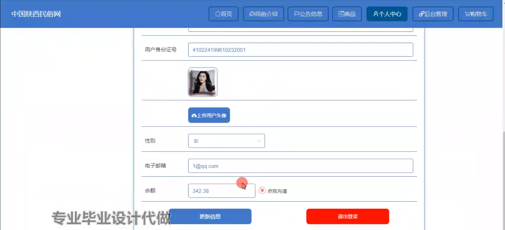

# 基于springboot的中国陕西民俗网

#### 介绍

陕西作为中华民族及华夏文化的重要发祥地之一，拥有丰富多彩、独具特色的民俗文化。然而，在当今数字化时代，这些珍贵的民俗文化面临着传承和推广的挑战，传统的宣传方式存在局限性，难以满足人们日益增长的对民俗文化了解和体验的需求。
基于 Spring Boot 开发的中国陕西民俗网旨在通过互联网技术，打造一个全面、生动、互动的平台，集中展示陕西民俗的魅力，促进民俗文化的传承、保护和发展，让更多的人了解和喜爱陕西民俗。

#### 技术栈

后端技术栈：Springboot+Mysql+Maven

前端技术栈：Vue+Html+Css+Javascript+ElementUI

开发工具：Idea+Vscode+Navicate

#### 系统功能介绍

（一）管理员角色  
个人中心：管理员可以在个人中心查看和修改自己的个人信息、登录密码等。  
管理员管理：  
新增管理员账号，并设置不同的管理权限。  
对现有管理员账号进行权限修改、信息更新和账号停用等操作。  
基础数据管理  
民俗类型管理：对陕西民俗进行分类，如传统节日民俗、民间艺术民俗、饮食民俗等，方便用户查找和浏览。  
公告类型管理：设置不同类型的公告，如活动通知、网站更新公告等。  
商品类型管理：对民俗相关商品进行分类，如手工艺品、特色食品、文化纪念品等。  
民俗介绍管理：  
上传和编辑陕西民俗的详细介绍，包括文字、图片、视频等多种形式的内容。  
对用户提交的民俗相关内容进行审核和发布。  
公告信息管理：  
发布各类公告信息，确保信息的准确性和及时性。  
编辑和删除已发布的公告，以适应网站的最新动态。  
商品管理  
商品管理：对民俗商品进行上架、下架、库存管理等操作。  
商品评价管理：查看用户对商品的评价，对不良评价进行处理和回复。  
商品收藏管理：了解用户对商品的收藏情况，分析热门商品趋势。  
商品订单管理：处理用户的商品订单，包括发货、退款等操作。  
用户管理：  
查看用户的注册信息和登录记录。  
对违规用户进行封禁或警告处理。  
轮播图信息：  
设置网站首页的轮播图，展示重要的民俗活动、特色商品等信息。  
定期更新轮播图内容，保持网站的吸引力。  

（二）用户角色  
民俗介绍：用户可以浏览丰富详细的陕西民俗介绍，包括各种民俗的历史渊源、文化内涵、传承现状等。  
公告信息：及时获取网站发布的最新公告，了解民俗活动通知、商品促销等信息。  
商品：  
查看各类民俗相关商品的详细信息和图片。  
对感兴趣的商品进行购买操作。  
个人中心：  
管理个人信息，如修改收货地址、联系方式等。  
查看自己的订单记录和交易历史。  
后台管理  
个人中心：修改个人资料、密码等。  
民俗介绍管理：收藏感兴趣的民俗介绍，分享给其他用户。  
公告信息管理：标记已读或未读公告，方便跟踪重要信息。  
商品管理  
商品管理：查看自己购买过的商品记录和评价。  
商品评价管理：对购买的商品进行评价和晒单。  
商品收藏管理：管理自己收藏的商品。  
商品订单管理：跟踪商品订单的物流信息和处理售后问题。  
购物车：  
将心仪的商品添加到购物车，方便统一结算。  
对购物车中的商品进行数量修改和删除操作。  

#### 系统作用

文化传承与推广  
为陕西民俗文化提供了一个集中展示和传播的平台，让更多人了解和认识陕西民俗的独特魅力。  

促进经济发展  
通过民俗商品的销售，带动当地相关产业的发展，增加就业机会和经济收入。  

增强文化交流  
用户可以在网站上交流对陕西民俗的感受和见解，促进不同地区文化的交流与融合。  

教育与学习  
为学者、学生和对民俗文化感兴趣的人提供了丰富的学习资源，有助于民俗文化的研究和教育。  

#### 系统功能截图

代码结构

数据库表

登录

前台页面首页

民俗介绍

公告信息

商品模块

个人中心

购物车

管理员端基础数据库管理

民俗介绍管理

商品管理

用户管理

用户端后台管理

#### 总结

基于 Spring Boot 的中国陕西民俗网在推动陕西民俗文化的传承和发展方面发挥了积极作用。然而，该系统仍存在一些不足之处，比如在民俗内容的深度挖掘和专业解读上还有待加强，用户互动功能的丰富性和趣味性需要进一步提升，对于移动端的适配和优化还不够完善。未来，我们将不断改进和完善系统，丰富民俗文化内容，优化用户体验，加强与相关机构和专家的合作，共同为保护和传承陕西民俗文化贡献力量。

#### 使用说明

创建数据库，执行数据库脚本 修改jdbc数据库连接参数 下载安装maven依赖jar 启动idea中的springboot项目

前台登录页面
http://localhost:8080/zhongguoshanximinsuwang/front/index.html

后台登录页面
http://localhost:8080/zhongguoshanximinsuwang/admin/dist/index.html

管理员				账户:admin 		密码：admin

用户				账户:a1 		密码：123456